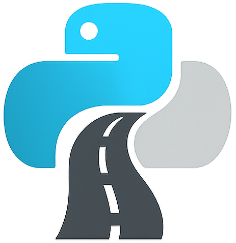

<p align="center"></p>
<div align="center"><h1>AI-Native Python</h1></div>

AI-Native Python sets you on a paved road of automated guardrails, where each commit is instantly checked for security, quality, and compliance.

It works seamlessly with GitHub Copilot, Cursor, Claude, Windsurf, and other leading AI coding agents to route their output through fully instrumented pipelines
of tests, security scans, and release automation.

Make your tools meet every requirement on the first pass, letting you ship faster without loosening safety or standards.

## Features

- 🤖 Well-established and tested AI tooling rulesets/instructions
- 🚀 Modern, lightning fast Python development with `uv`
- 🧪 Automated testing with `pytest` with 100% coverage
- 🔍 Code quality checks on every commit with `pre-commit`
- 🔐 Security scanning with SBOM generation, vulnerability scanning, and license checks
- ⚙️ Never think about upstream vulnerabilities again with **automated dependency upgrades**
- 📦 Ensure usability across all major platforms with multi-platform Docker builds
- 🔄 Automated versioning and releasing with `python-semantic-release`

For more details, see our [documentation](docs/index.md).

## Getting Started

1. Create an [empty GitHub repository](https://docs.github.com/en/repositories/creating-and-managing-repositories/creating-a-new-repository)
1. Ensure you have [`brew`](https://brew.sh/) installed
1. Generate a project with the same name as the repo you just made:

    ```bash
    # Install the prerequisites
    brew install uv go-task

    # Initialize your project
    uvx --with gitpython cookiecutter gh:zenable-io/ai-native-python
    ```

> [!NOTE]
> Check out our video walkthrough [here](https://www.youtube.com/watch?v=YzlLchW-wtg)

## Next Steps

Now that you've generated the initial repository you can configure any required repository settings such as rulesets/branch protections. This can be done via
Infrastructure as Code (IaC) or manually, but ostensibly by this point your repository is aligned with your organizational practices and you're ready to start
adding features.

> [!TIP]
> Consider a tool like OpenSSF [allstar](https://github.com/ossf/allstar) to monitor these settings automatically.

### Adding a feature

To make a change to the project, just replace the `NotImplementedError` placeholder and you're all set!

```bash
# Enter the project directory
cd $(ls -td * | head -1)

# Checkout a new branch for your initial content
git checkout -b initial-content

# Check for `NotImplementedError`s and address them as a part of adding your business logic
grep -r NotImplementedError *
```
